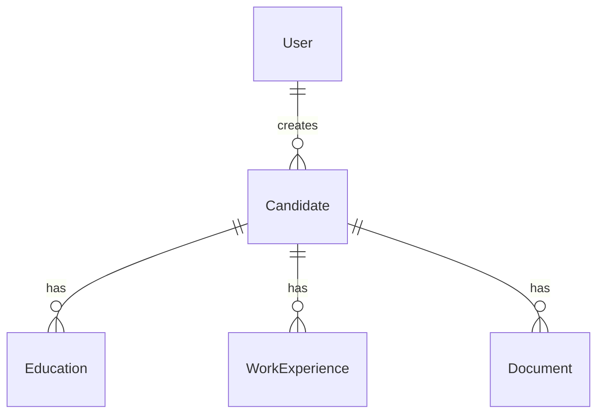

# Modelo de Datos - LTI Talent Tracking System

## Diagrama Entidad/Relación



## Entidades

### User

Usuario del sistema (reclutador).

| Campo | Tipo | Restricciones | Descripción |
|-------|------|---------------|-------------|
| id | UUID | PK | Identificador único |
| email | String | Unique, Not Null | Correo electrónico |
| name | String | Nullable | Nombre del usuario |

---

### Candidate

Candidato gestionado en el sistema.

| Campo | Tipo | Restricciones | Descripción |
|-------|------|---------------|-------------|
| id | UUID | PK | Identificador único |
| userId | UUID | FK → User, Not Null | Reclutador que creó el candidato |
| firstName | String | Not Null | Nombre |
| lastName | String | Not Null | Apellido |
| email | String | Unique, Not Null | Correo electrónico |
| phone | String | Nullable | Teléfono (texto libre) |
| address | String | Nullable | Dirección (texto libre) |
| status | Enum | Not Null | Estado del candidato |
| createdAt | DateTime | Not Null, Auto | Fecha de creación |
| updatedAt | DateTime | Not Null, Auto | Fecha de última actualización |

#### CandidateStatus (Enum)

| Valor | Descripción |
|-------|-------------|
| `ACTIVE` | Candidato disponible en el pool |
| `IN_PROCESS` | En proceso de selección activo |
| `HIRED` | Contratado |
| `REJECTED` | Descartado |
| `WITHDRAWN` | El candidato se retiró del proceso |

---

### Education

Formación académica del candidato.

| Campo | Tipo | Restricciones | Descripción |
|-------|------|---------------|-------------|
| id | UUID | PK | Identificador único |
| candidateId | UUID | FK → Candidate, Not Null | Candidato asociado |
| institution | String | Not Null | Institución educativa |
| degree | String | Not Null | Título obtenido |
| fieldOfStudy | String | Nullable | Campo de estudio o especialidad |
| startDate | Date | Not Null | Fecha de inicio |
| endDate | Date | Nullable | Fecha de fin (null si en curso) |
| createdAt | DateTime | Not Null, Auto | Fecha de creación |

---

### WorkExperience

Experiencia laboral del candidato.

| Campo | Tipo | Restricciones | Descripción |
|-------|------|---------------|-------------|
| id | UUID | PK | Identificador único |
| candidateId | UUID | FK → Candidate, Not Null | Candidato asociado |
| company | String | Not Null | Nombre de la empresa |
| position | String | Not Null | Cargo desempeñado |
| startDate | Date | Not Null | Fecha de inicio |
| endDate | Date | Nullable | Fecha de fin (null si es empleo actual) |
| description | String | Nullable | Descripción de responsabilidades |
| createdAt | DateTime | Not Null, Auto | Fecha de creación |

---

### Document

Documentos asociados al candidato (CV, cartas, certificados).

| Campo | Tipo | Restricciones | Descripción |
|-------|------|---------------|-------------|
| id | UUID | PK | Identificador único |
| candidateId | UUID | FK → Candidate, Not Null | Candidato asociado |
| fileUri | String | Not Null | URI del archivo (ver esquema abajo) |
| fileName | String | Not Null | Nombre original del archivo |
| mimeType | String | Not Null | Tipo MIME (`application/pdf`, etc.) |
| size | Int | Not Null | Tamaño en bytes |
| type | Enum | Not Null | Tipo de documento |
| uploadedAt | DateTime | Not Null, Auto | Fecha de subida |

#### DocumentType (Enum)

| Valor | Descripción |
|-------|-------------|
| `CV` | Currículum Vitae |
| `COVER_LETTER` | Carta de presentación |
| `OTHER` | Otro documento |

#### Esquema de URI para almacenamiento

El campo `fileUri` utiliza un esquema de URI que permite abstraer el backend de almacenamiento:

```
<scheme>://<path>
```

| Scheme | Descripción | Ejemplo |
|--------|-------------|---------|
| `fs` | Filesystem local | `fs://uploads/cv/abc123.pdf` |
| `minio` | MinIO object storage | `minio://candidates/cv/abc123.pdf` |

Esto permite migrar entre backends de almacenamiento sin modificar los registros existentes.

---

## Relaciones

| Relación | Cardinalidad | Descripción |
|----------|--------------|-------------|
| User → Candidate | 1:N | Un reclutador puede crear múltiples candidatos |
| Candidate → Education | 1:N | Un candidato puede tener múltiples registros de educación |
| Candidate → WorkExperience | 1:N | Un candidato puede tener múltiples experiencias laborales |
| Candidate → Document | 1:N | Un candidato puede tener múltiples documentos |

---

## Notas de Diseño

1. **UUIDs**: Todas las entidades usan UUID como clave primaria para mayor seguridad en URLs y APIs públicas.

2. **Soft Delete**: No implementado en esta versión. Los registros se eliminan físicamente.

3. **Almacenamiento de archivos**: En fase MVP se usa filesystem local (`fs://`). Preparado para migrar a MinIO (`minio://`) sin cambios en el modelo de datos.

4. **Campos de texto libre**: `phone` y `address` en Candidate se mantienen como texto libre para flexibilidad.

5. **Campos estructurados**: Education y WorkExperience están estructurados para permitir filtros y búsquedas avanzadas.
