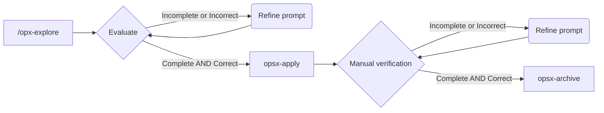

# Task 00 - Project setup

## SDD Workflow



## Prompt inicial

Run with `opx-explore`

```
Vamos a emprezar a trabajar en la tarea @plan/task-00.md. Hay algunas cosas que el proyecto ya trae echas. Quiero que analices lo que falta y me crees un proposal para realizarlo
```

### Resultado

Una vez analizados los artefactos creados por OpenSpec, parece que todo es correcto y empezamos a implementar los cambios con `ops-apply`.

## Resultado de la implementación

La implemlementación ha sido correcta, hemos configurado correctamente todo lo que se le solicitaba y además hemos coregido los probleams de formateo y linting

## Archivado

Al archivar hemos optado por no promociona la spec, ya que esto es una tarea inicial de setup, no obstante el cambio realizado se puede 
consultar en `.openspec/changes/archive/2026-03-16-setup-linting-formatting`