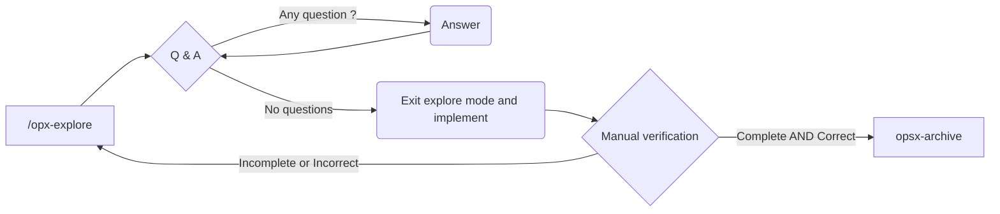
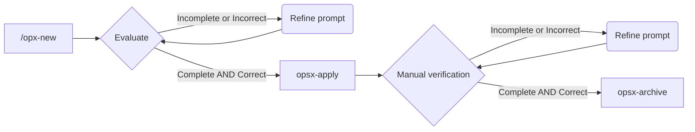

# Task 01 - Security and Priacy

## SDD Workflow



## Prompt inicial

Run with `opx-explore`

```
Vamos a emprezar a trabajar en la tarea @plan/task-01.md. Hazme cualquier pregunta relevante para completar la tarea.
```

### Resultado

El agente me reailza las siguientes preguntas

#### Sobre el contexto regulatorio:

- ¿Los candidatos son de la UE / España? Si es así, GDPR/LOPD entra en juego con requisitos concretos (consentimiento explícito, derecho al olvido, DPO, etc.). ¿Es esto un requerimiento?

*Respuesta*:

Los candidatos son de la UE, no obstante, ten en cuena que esto es un MVP. Vamos a implementar lo mínimo necesario y lo completaremos para más adelante.

#### Sobre autenticación:
- La historia de usuario menciona "reclutador" — ¿hay un sistema de autenticación planificado, o el acceso al sistema se asume seguro por estar en red interna? Esto cambia radicalmente lo que hay que documentar.

*Respuesta*

Vamos a implementar un sistema de autenticación externo más adelante, ahora estamos en una fase muy temprana. Asume que el usuario que accede a la plataforma es un Reclutador ya verificado.

#### Sobre el CV (archivos):

- Los uploads de PDF/DOCX son una superficie de ataque importante. ¿Tienes en mente dónde se almacenan? ¿Filesystem local, S3/blob storage, base de datos? La respuesta afecta las mitigaciones.

*Respuesta*

Vamos a usar Minio como servicio para gestionar los documentos, pero esto lo pondremos en marcha en la próxima iteración. En esta iteración simula todas las operaciones sobre documentos y usa el filesystem si lo necesitas para algo.

#### Sobre el alcance del documento:

- ¿Quieres que la documentación sea solo para este ATS (herramienta interna de una empresa) o tiene que servir como guía general reutilizable? Cambia el nivel de detalle y los supuestos.

*Respuesta* 

La documentación será sólo para ese proyecto

#### Sobre la audiencia:

- ¿Lo leerán desarrolladores que van a implementar, o también stakeholders no técnicos (compliance, management)?

*Respuesta*

De momento la audiencia serán desarrolladores, tanto humanos como IA. Debe ser una documentación muy escueta y concisa, ten en cuenta que la vamos a pasar como contexto a agentes de IA que se encarguen de implementar las distintas tareas.

#### Sobre el filesystem para CVs

¿Aceptas un directorio uploads/ en el proyecto, o prefieres que el doc solo describa el contrato (ruta configurada por env var) y la implementación decida la ubicación?

*Respuesta*

Adepto el directorio uploads/. 

#### Sobre el tono — Para AI agents como audiencia, 

¿Prefieres listas de reglas explícitas (✅ MUST, ⚠️ SHOULD, ❌ MUST NOT) o secciones con párrafos cortos? Las reglas explícitas tienden a seguirse más fielmente por los agentes.

*Respuesta*

Prefiero reglas explícitas.

## Resultado de la implementación

El agente ha escrito correctamente los dos documentos solicitados.

No obstante leer los [requisitos para el backend](../../docs/backend-security.md) parece ser que hay algunas tareas genéricas que habría de configuración que habría que hacer.

Iniciamos un segundo ciclo de iteración para realizar dichas tareas.


## Segundo ciclo de exploración

Run with `opx-explore`

```
Según @docs/backend-security.md hay algunas tareas de configuración que deberíamos hacer antes de empezar, ¿es así?.
```

### Resultado

Esto es lo que me dice el agente

````
Aquí hay algo interesante para explorar. Hay dos lecturas:

Lectura A — Son prerequisitos de infraestructura
> helmet, cors, el error handler, rate limiting — ninguno depende del modelo Candidate. Podrían (y quizás deberían) estar listos antes de implementar cualquier endpoint.

Lectura B — Son parte del mismo feature
> La validación con zod, multer, y rate limiting en rutas específicas — solo tienen sentido cuando existen las rutas. No hay forma de aplicar rate limiting a /candidates si esa ruta no existe aún.

Hay una tensión real aquí: algunas cosas son horizontales (aplican a toda la app) y otras son verticales (específicas al feature de candidatos).

HORIZONTAL (se puede hacer ahora, independiente)
  └── helmet
  └── cors + ALLOWED_ORIGIN
  └── error handler centralizado (JSON, sin stack traces)
  └── express.json() bodyparser
VERTICAL (depende del feature de candidatos)
  └── zod schema para campos del candidato
  └── multer para CV uploads
  └── rate limiting en /candidates endpoints
  └── .env con UPLOAD_DIR

---
¿Qué estás pensando? ¿Quieres hacer las horizontales primero como una especie de "baseline de seguridad" antes de los tasks de feature? ¿O prefieres que todo vaya junto en el mismo task de implementación?
````

*Respuesta*

Vamos a realizar todo aquello que sea horizontal. Aquí, siguiendo instrucciones del agente, creo un nuevo proposal.

## Nuevo proposal

Para trabajar con el nuevo proposal seguimos el siguiente flujo de SDD



Tras leer la primera propuesta se me ocurre que sería interesante tener un endpoint "dummy" para validar que el backend está operativo. Introduzco el siguiente prompt:

```
Me gustaría crear un primer endpoint de tipo "health check" o "verify" para poder comprobar si el backend es completamente funcional tras realizar este cambio
```

Par esto OpenSpec me crea un nuevo cambio, el cuál trabajaremos usando el siguiente flujo tras terminar con este primero.

## Implementación

Tenemos dos cambios listos para implementar:

- backend-security-baseline
- health-check-endpoint 

### backend-security-baseline 

Ejecuto el comando `/opsx-apply backend-security-baseline`.

Durante la implementación el agente se ha dado cuenta que había un test roto en el backend, le he dicho que corrija el test.

El resultado parece correcto, vamos a esperarnos a tener el endpoint dummy y veremos si todo va bien.

Archivo el cambio y empeiezo con el siguiente

```
/opx-archive backend-security-baseline
```

No promociono la spec. El cambio puede consultarse en `.openspec/changes/archive/2026-03-16-backend-security-baseline`

### health-check-endpoint 

Ejecuto el comando `/opsx-apply health-check-endpoint`.

La implementación es correcta, pero voy a usar */opsx-verify* para comprobar si todo es correcto

```
/opsx-verify haz todas las pruebas necesarias para comprobar que el endpoint /health está correctamente configurado según @docs/backend-security.md. Usa curl para acceder. El backend ya está levantado.
```

Reviso el informe y compruebo que todos los checks pasan. Archivo el cambio, y esta vez SÍ promociono la spec.

```
/opsx-archive health-check-endpoint
```
