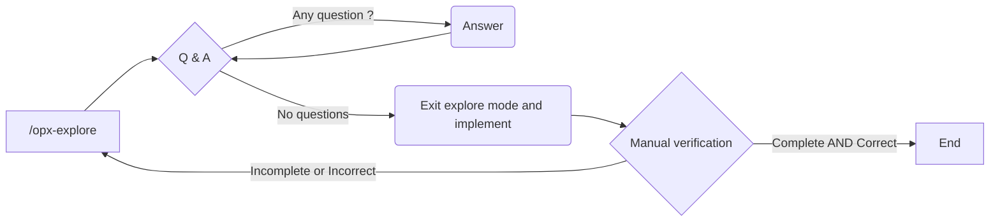

# Task 02 - Definición del modelo de datos

## SDD Workflow



## Prompt inicial

Run with `opx-explore`

```
Vamos a emprezar a trabajar en la tarea @plan/task-02.md. Hazme cualquier pregunta relevante para completar la tarea.
```

### Resultado

El agente me pregunta cómo almacenar los CV. Esta es mi respuesta

```
Por ahora vamos a almacenar en el filesystem porque estamos en fase de MVP, pero más adelante usaremos Minio. ¿Podemos introducir algún prefijo a la ruta del archivo que nos diga qué "protocolo" usamos? (p.e fs:<ruta> o minio:<ruta>)?
```

El agente analiza el prompt y me propone

```
¿Te convence fs:// y minio:// como formato? 
```

Yo acepto la propuesta.

El agente también me pregunta qué campos deben ser estrucutrados y cuáles de texto libre. Le digo que deb en ser estructurados los campos "Educación" y "Experiencia" y texto libre los demás.

Me pregunta

Q: ¿El email del candidato debe ser único?

A: Sí

---

Q: ¿El Candidate debe tener un campo status?

A: Sí

---

Q: Usamos UUIDs o IDs autoincrementales?

A: UUIDs


Una vez respuestas estas preguntas salgo del modo exploración y le digo que genere el documento.
