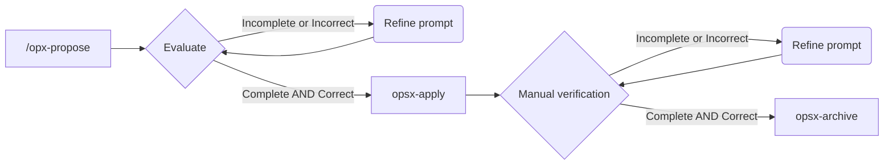

# Task 03 - Data setup + seeding

## SDD Workflow



## Prompt inicial

Run with `opx-propose`

```
Vamos a crear las tablas en la BD y a poblarlas con datos de prueba siguendo @plan/task-03.md
```

### Resultado

Al revisar los artefactos creados, todo parece correcto, por lo que pasamos directamente a la implementación

## Implemenmtación

Run with `ops-apply`

### Resultado

La implementación es correcta. Se han creado todos los archivos solicitados y he comprobado que en la BD existen las tablas y que estas tienen datos.

Voy a pedirle que revise el archivo README principal y añada instrucciones para ejecutar la migración y el seed al levantar el proyecto por primera vez.

Para esto voy a utilizar el modo **Plan** de *OpenCode*, revisaré que lo que me propone es correcto y luego lo ejecutaré pasando al modo **Build**

**Prompt**

```
Revisa el archivo @README.md y añade lo necesario para que se quede documentado cómo se debe inicializar + poblar la BD al levantar el entorno de desarrollo por primera vez
```

## Archivado

Una vez comprobado que todo es correcto, archivamos el cambio pero NO promocionamos la spec. Pueden consultarse los detalles del cambio en `.openspec/changes/archive/2026-03-16-db-setup-and-seeding`


