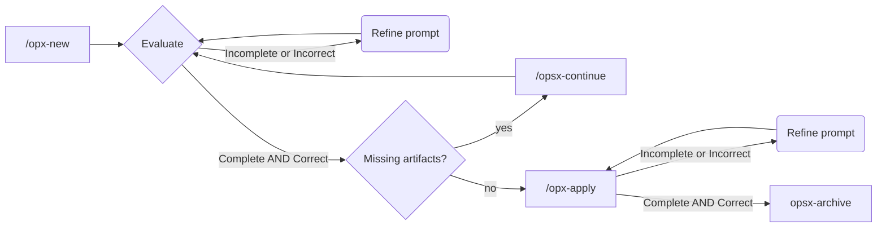

# Task 04 - Backend

## SDD Workflow



## Prompt inicial

Run with `opx-new`

```
Vamos a crear los endpoints necesarios para la história de usuario, sigue las instrucciones en @plan/task-04.md 
```

### Resultado

#### proposal.md

En un principio el agente entiende que sólo son necesarios los endpoints para crear el candidato, le indico que también debe generar los endpoints para obtener el listado de candidatos y obtener la información de un candidato.

Una vez comprobada que la propuesta es correcta y completa pasamos a crear las specs con `/opsx-continue`

#### Specs

##### candidate-management

Compruebo que la especificación es correcta, se cubren algunos "edge cases" y se tiene en cuenta la validación de datos. Me conformo.

##### document-upload

Compruebo que la especificación es correcta, se cubren algunos "edge cases" y se tiene en cuenta la validación de datos. Me conformo.

Una vez comprobadas que las specs son correctas y completas, voy a solicitar el documento de diseño con `/opsx-continue`

#### design.md

Me fijo en la  sección de **Goals / Non goals** para ver el alcance exacto de esta tarea

```
**Goals:**
- Implementar CRUD parcial de candidatos (Create, Read, List)
- Permitir subida de documentos asociados a candidatos
- Establecer arquitectura por capas (routes → controllers → services → repositories)
- Cumplir requisitos de seguridad definidos en backend-security.md

**Non-Goals:**
- Update/Delete de candidatos (fuera del alcance de esta historia)
- Autenticación/autorización (se asume caller verificado)
- Descarga de documentos (solo subida)
- Búsqueda avanzada o full-text search
- Migración a MinIO (se usa filesystem local con esquema URI preparado)
```

La propuesta me parece correcta.

Me fijo en las decisiones de arquitectura tomadas y me parecen correctas, las apruebo.

El agente deja algunas preguntas abiertas. Añado algunos comentarios al documento a modeo de respuesta. El documento está disponible para su revisión en `openspec/changes/archive/2026-03-16-candidate-api-endpoints/design.md`

Una vez revisado le indico que genere el listado de tareas con `/opsx-continue`

#### tasks.md

Reviso las tareas y me parecen correctas y completas. Sólo añado una tarea al final, para que pruebe los endpoints uno a uno a través de Swagger UI usando el MCP de Playwright. Se puede revisar en `openspec/changes/archive/2026-03-16-candidate-api-endpoints/tasks.md`

Una vez todo verificado le indico que empiece la implementación con `/opsx-apply`

### Implementación

Compruebo que la implementación sea correcta. 

Me he fijado en cómo se ejecutaban los tests de los endpoints con Swagger UI de forma automática y eso me ha confirmado que los endpoints funcionan.

Realizo una revisión rápida del codigo y todo me encaja razonablemente bien.

Voy a dar el desarrollo como finalizaddo y aprobado y lo archivo mediante `/opsx-apply`.

## Archivado

Archivo el cambio y promociono la spec.