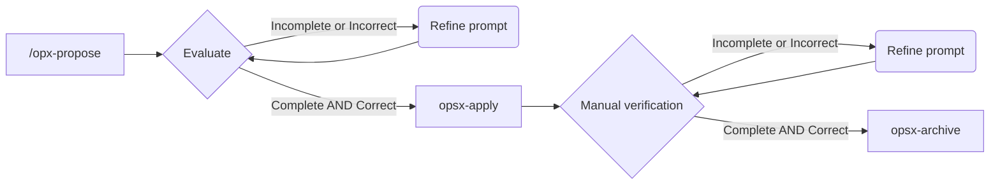

# Task 05 (prev) - Auto login

Esta es una tarea previa a la implementación del frontend. 

A la aplicación le falta una página inicial (el dashboard) al cuál le podamos añadir el botón para crear un nuevo candidato.

Tampoco existe un listado de candidatos que se puedan editar.

Otra cosa que nos falta es el proceso de login, que hemos dejado fuera del MVP (por que sí)

Esto lo solucionaremos mediante:

- Una funcionalidad de auto-login, válida sólo para el MVP. Esto constará de
    - un endpoint de auto-login del backend que nos devolverá uno de los usuarios que haya en la BD
    - una página de inicio en el frontend, que mostrará el listado de candidatos relacionados con ese usuario

## SDD Workflow



## Prompt inicial

Run with `opx-propose`

```
Vamos a crear una funcionalidad de auto-login que nos va a servir únicamente para el MVP. Esta debe consistir en 

-  un endpoint en el backend `/autologin` (válido sólo en el MVP) que nos devolverá toda la información relativa al usuario: ID, email y nombre
- una página inicial (aka dashboard), cuando un usuario accede al frontend, se invoca al endpoint de autologin y cuando este responde se le redirige a una pantalla que mostrá los datos del usuario (nombre + email) y un listado de sus candidatos.

Notas: 

- cuando crees el nuevo endpoint en el backend, comprueba que aparezca en Swagger UI y ejecuta el siguiente comando para regenerar el archivo `openapi.json`: `curl http://localhost:3010/api-docs.json -o openapi.json`. 
- cuando crees el dashborard consuta la documentación de los endpoints que tendrás en `openapi.json`
- algoritmo para elegir al usuario: ordena por UUID y devuelve el primero.
```

### Resultado

Reviso los artefactos creados y todo me parece correcto, continúo con la implementación mediante `/opsx-apply`

## Implementación

El resultado es el siguiente

- ✅ backend: implementación correcta, no se respeta la separación entre capas pero no importa, por ser una funcionalidad que desaparecerá en breve
- ❌ frontend: al acceder hay un error de compilación

Le solicito al agente que lo revise y lo arregle, con el siguiente prompt

Mode: plan
```
accede al frontend con el mcp de playwrigth y revisa el error de compilación, averigua la causa del error y arreglalo
```

La causa del error es la siguiente

```
Causa del Error de Compilación

El Error

[eslint] 
src/pages/Dashboard.tsx
  Line 22:28:  Replace `CandidateStatus,·'default'·|·'primary'·|·'success'·|·'error'·|·'warning'` with `⏎··CandidateStatus,⏎··'default'·|·'primary'·|·'success'·|·'error'·|·'warning'⏎`  prettier/prettier
src/services/api.ts
  Line 12:28:  Replace `endpoint:·string,·options?:·RequestInit` with `⏎····endpoint:·string,⏎····options?:·RequestInit,⏎··`  prettier/prettier

Explicación
El error fue causado por ESLint con el plugin prettier/prettier, que actúa como regla de linting para hacer cumplir el formato de Prettier.

¿Qué pasó?

1. Prettier tiene un límite de longitud de línea (por defecto 80 caracteres, configurable via printWidth).

2. Las líneas que escribí eran demasiado largas:
   
   - Dashboard.tsx:22 tenía ~95 caracteres:
          const statusColors: Record<CandidateStatus, 'default' | 'primary' | 'success' | 'error' | 'warning'> = {
        
   - api.ts:12 tenía ~85 caracteres:
          private async request<T>(endpoint: string, options?: RequestInit): Promise<T> {
     
3. ESLint + Prettier como regla de lint: En este proyecto, el frontend usa eslint-config-react-app que integra Prettier. Cuando ejecutas npm run build, CRA ejecuta ESLint como parte del proceso de compilación. Si hay violaciones de prettier/prettier, el build falla.

¿Por qué falló el build y no solo mostró warnings?

Create React App (CRA) trata los errores de ESLint como errores de compilación en producción builds (npm run build). A diferencia de npm start (dev mode) que puede mostrar warnings en el navegador, el build de producción es estricto.

La Solución

Reformatear el código siguiendo las reglas de Prettier - dividiendo las líneas largas en múltiples líneas:

// Antes (línea muy larga)
const statusColors: Record<CandidateStatus, 'default' | 'primary' | ...> = {

// Después (formato correcto)
const statusColors: Record<
  CandidateStatus,
  'default' | 'primary' | 'success' | 'error' | 'warning'
> = {

Lección Aprendida

Al escribir código en proyectos con Prettier configurado, es importante:
- Respetar el printWidth (longitud máxima de línea)
- Usar saltos de línea en tipos genéricos largos y parámetros de funciones
- Idealmente, ejecutar npx prettier --write <file> después de crear archivos nuevos
```

Cambio a modo **Build** y lo arreglo. Compruebo que funciona correctamente.

Le digo al agente que se acuerde de la "lección aprendida" para que no vuelva a ocurrir. Esto añade una modificación `AGENTS.md`.

## Archivado

Una vez la implementación es satisfactoria archivo el cambio promocionando las specs con `/opsx-archive`.
