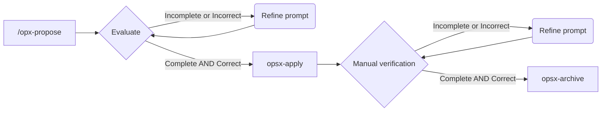

# Task 05 - User Interface

## SDD Workflow



## Prompt inicial

Run with `opx-propose`

```
/opsx-propose Vamos a crear la interfaz de usuario según @plan/task-05.md 
```

### Resultado

Simplemente leyendo `proposal.md` me parece que este es deficiente. Refino la propuesta con el siguiente prompt

```
Ten en cuenta los criterios de aceptación de @plan/user-story.md. Debe aparecer un botón para crear un nuevo candidato en el **user-dashboard**. La subida de documentos no la realizaremos al crear el candidato, sino una vez creado. Para ello lo seleccionaremos en la lista de candidatos del **user-dashboard** y accederemos a una página que nos mostrará el detalle del candidato junto y desde ahí podremos subir documentos.
````

Ahora la propuesta parece correcta, reviso en este orden:

1. specs
2. design.md
3. tasks.md

Estos artefactos son correctos. Pero antes de implementarlos me doy cuenta de una cosa. El "dashboard" muestra todos los candidatos y debería mostrar sólo los candidatos relacionados con el reclutador logueado.

Voy a proponer un nuevo cambio y seguiré el flujo propuesto antes de continuar con la tarea principal

```
propose -> apply -> archive
````

Una vez terminada esta nueva tarea vuelvo a la tarea inicial. Nos habíamos quedado en que estábamos pendientes de implementar.

## Implementación

Vuelvo a la sesión en dónde estaba realizando la tarea principal y empiezo la implementación con `/opsx-apply`.

### Resultado

- ✅ Ejecuto `/opsx-verify` para comprobar que todos los requisitos estén cubiertos. Todo ok.
- ✅ Primero compruebo que todo funciona según lo previsto mediante una navegación. El resultado es correcto.
- ⚠️ Luego realizo una revisión de código y  hay alguna cosilla que no me convence. No obstante, como esto es un ejercicio voy a ser permisivo y lo dejaré pasar.

## Archivado

Archivo promocionando la spec con `/opsx-archive`


